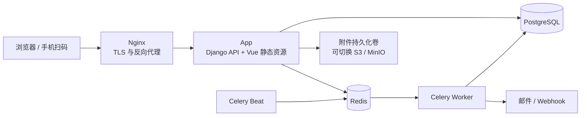

# 行政 IT 资产管理系统方案

版本：V0.1
日期：2026-07-23
定位：面向中小型组织的轻量行政 / IT 资产管理系统，以 Docker Compose 方式部署。

## 1. 结论先行

建议建设的不是一个“大而全”的 ITSM 或 CMDB，而是一套围绕以下三个问题设计的轻量系统：

1. 公司现在有什么资产、在哪里、值多少钱？
2. 每件资产当前由谁保管、经历过哪些流转？
3. 盘点、归还、维修、到期和报废时，怎样快速完成并留下凭据？

产品形态建议参考 Snipe-IT 的资产领用、归还、标签和历史记录，以 GLPI 的资产分类完整性、Freshservice 的全生命周期思路和 Jira Assets 的灵活对象关系作为补充，但首版主动排除复杂 ITSM、CMDB 依赖关系和自动网络发现。

首版应优先做到：

- 资产台账统一；
- 扫码即可查看和办理资产；
- 领用、借用、归还、调拨、送修、报废全部留痕；
- 支持 Excel 初始导入和批量操作；
- 支持按地点发起盘点并自动生成差异；
- 保修、借用和软件许可到期提醒；
- 权限、数据范围和审计日志清晰；
- 一台服务器通过 Docker Compose 即可部署和备份。

## 2. 市面产品调研摘要

本次选择的是几种具有代表性的产品，不是市场排名。

| 产品 | 优点 | 对本系统的启发 | 不直接照搬的部分 |
| --- | --- | --- | --- |
| Snipe-IT | 专注 IT 资产；领用/归还直观；支持 QR/条码、自定义字段、审计、附件、许可证和到期提醒；有官方 Docker 镜像和 Compose 指引 | 作为首版业务骨架；每件资产有完整历史；标签和扫码优先；资产、配件、耗材和许可证分开管理 | 原生界面和字段较偏 IT 管理员；国内组织、审批和通知集成需另做适配 |
| GLPI | 资产类型非常全；兼有库存、合同、供应商、许可证、工单、自动采集和多实体权限 | 参考分类、合同/供应商关联及数据范围设计 | 功能面过宽；工单、问题、变更、SLA、机房和网络拓扑不进入首版 |
| Freshservice | 把请求、采购、部署、使用、维护和退役串成完整生命周期；自助门户和工作流体验成熟 | 参考入职领用、离职回收、到期提醒和生命周期报表 | SaaS 和企业级 ITSM 能力较重；首版不建设通用流程引擎 |
| Jira Assets | 对象模型灵活；资产可关联请求、事件和变更；支持模板、查询、自动化和发现 | 数据模型保留扩展字段及关系能力，未来可关联工单 | 对象模式、AQL、CMDB 关系图学习成本高，不适合作为行政人员日常入口 |

调研后的产品判断：

- 如果只是快速替代 Excel，直接部署 Snipe-IT 是最低成本选项。
- 如果需要更符合中文行政习惯的页面、组织数据权限、离职回收、国内消息渠道和自定义流程，建议建设本文的轻量定制系统。
- 不建议在首版同时建设资产管理、服务台、采购审批、自动发现和完整 CMDB；这会使简单系统迅速变复杂。

## 3. 产品目标与边界

### 3.1 目标用户

- 行政资产管理员：维护台账、办理流转、盘点、报表；
- IT 管理员：维护设备技术信息、维修、许可和到期项；
- 部门资产负责人：查看本部门资产、协助盘点和确认；
- 普通员工：查看和确认本人名下资产，发起归还或报修；
- 审计 / 财务：只读查询、导出和查看历史。

### 3.2 首版适用规模

建议以以下规模设计和验收：

- 资产数量：1 万件以内；
- 用户数量：1,000 人以内；
- 同时在线：50 人以内；
- 单组织，可包含多公司主体、部门、办公室和库房。

该范围是首版工程设计目标，不是硬性系统上限。

### 3.3 首版纳入

- 有唯一编号的实物资产：电脑、显示器、手机、平板、打印机、网络设备、办公设备等；
- 数量型物品：键鼠、扩展坞、适配器等配件；
- 消耗品：硒鼓、电池、网线等；
- 软件许可证和 SaaS 席位；
- 员工、部门、地点、库房、供应商；
- 领用、借用、归还、调拨、维修、遗失、退役、报废；
- QR / 条码标签；
- 盘点任务；
- 导入、导出、报表、提醒和审计日志。

### 3.4 首版不纳入

- 通用采购审批和财务付款；
- 固定资产会计凭证、自动折旧和总账；
- 通用工单、SLA、问题和变更管理；
- 服务器、应用、数据库之间的 CMDB 依赖图；
- 局域网自动扫描、终端代理和软件使用计量；
- MDM、远程控制、补丁和安全合规；
- 复杂低代码流程设计器。

这些能力保留接口，但不进入 MVP。

## 4. 关键产品原则

### 4.1 业务动作驱动状态

用户不应直接把资产状态从“在库”改成“在用”。系统通过“领用”动作产生使用人、交接记录和在用状态。归还、送修和报废同理。

这样可以避免“状态改了但没有人、地点或凭据”的脏数据。

### 4.2 资产记录原则上不物理删除

误录资产可以作废；已发生流转的资产只能退役或报废。历史事件、操作人和时间必须保留。

### 4.3 一物一码，数量型物品单独管理

- 笔记本、手机、显示器等按单件建档，每件有资产编号；
- 鼠标、网线、硒鼓等按 SKU 和库存数量管理；
- 不强迫低价值消耗品逐件贴码。

### 4.4 扫码优先，同时保留搜索

扫码不是唯一入口。每个扫码流程都必须可以通过资产编号、序列号、员工姓名或关键词完成。

### 4.5 默认简单，高级字段按类别出现

所有资产只显示通用字段。选择“笔记本电脑”后才显示 CPU、内存、硬盘、主机名等字段；选择“手机”后显示 IMEI、号码等字段。

## 5. 信息架构和页面

管理员端顶部导航建议仅保留六项：

1. 首页
2. 资产
3. 库存
4. 盘点
5. 报表
6. 设置

页面右上角始终提供“扫码”和“新增”。

### 5.1 首页

首页只回答需要立即处理的问题：

- 资产总数、在用数、在库数、维修数；
- 待归还借用；
- 30 / 60 / 90 天内保修、合同和许可证到期；
- 盘点进度和差异；
- 最近流转；
- 快捷操作：领用、归还、调拨、盘点、导入。

### 5.2 资产列表

默认列：

- 资产编号；
- 名称 / 型号；
- 分类；
- 状态；
- 使用人 / 保管部门；
- 当前地点；
- 保修到期；
- 最后盘点时间。

常用筛选：

- 状态、分类、部门、地点、使用人；
- 即将到期；
- 长期闲置；
- 超期未还；
- 数据不完整；
- 未盘点 / 盘点异常。

资产详情页采用“一页摘要 + 标签页”：

- 摘要：状态、使用人、地点、关键规格、快速操作；
- 基本信息；
- 流转历史；
- 维修记录；
- 采购与保修；
- 附件；
- 操作日志。

### 5.3 库存

库存分为：

- 单件资产在库清单；
- 配件库存；
- 消耗品库存；
- 许可证席位。

数量型库存必须通过入库、发放、退回、调整和报损单改变，不能直接覆盖数量。

### 5.4 普通员工端

普通员工只需要三个页面：

- 我的资产；
- 待我确认；
- 我的申请。

员工可执行：

- 确认领取或交接；
- 申请归还；
- 报修 / 报失；
- 查看借用到期日。

## 6. 核心业务流程

### 6.1 采购到货与入库

1. 管理员新增一批到货记录或导入 Excel；
2. 选择分类、品牌、型号、采购信息和默认地点；
3. 系统批量生成唯一资产编号；
4. 打印 QR / 条码标签；
5. 资产进入“在库可用”。

建议资产编号规则可配置，例如：

`IT-LT-2026-123`

其中 `LT` 为笔记本类别码。编号生成后不可复用。

### 6.2 长期领用

1. 扫描资产；
2. 搜索员工或部门；
3. 确认领用日期、地点和备注；
4. 可选员工电子确认；
5. 系统生成交接事件，资产自动变为“在用”。

目标体验：熟练管理员在一个页面、三个主要动作内完成。

### 6.3 临时借用

借用与长期领用使用同一界面，但必须填写预计归还日期。系统在到期前提醒借用人和管理员，超期后进入待办。

### 6.4 归还与换机

- 归还：扫码、检查成色、选择归还地点，资产回到“在库可用”或“待检”；
- 换机：同一流程先归还旧资产，再领用新资产，形成两条独立事件；
- 归还时可记录外观、配件是否齐全和附件照片。

### 6.5 调拨

调拨用于地点、库房或保管部门变化，不等于领用。

1. 选择一个或多个资产；
2. 选择目标地点 / 部门和接收人；
3. 接收方确认；
4. 系统更新归属并保留调出、在途、接收记录。

简单场景可关闭接收确认，直接完成。

### 6.6 维修

1. 从资产页发起送修；
2. 记录故障、服务商、送修日期和预计返回日；
3. 资产进入“维修中”且不能再次领用；
4. 完成时记录结果、费用、更换部件和附件；
5. 返回原使用人或进入库存。

维修记录不是通用工单系统。

### 6.7 盘点

1. 管理员按地点、部门或分类创建盘点任务；
2. 系统冻结本次盘点的应盘清单快照；
3. 盘点人通过手机浏览器连续扫码；
4. 系统即时标记正常、位置不符、使用人不符、账外和重复；
5. 完成后生成盘盈、盘亏和信息差异；
6. 管理员审核并逐项处理，不能直接静默覆盖台账。

盘点必须保留“盘点时应有数据”，否则无法复核历史差异。

### 6.8 离职回收

员工详情页展示其名下所有资产、配件和许可证。管理员可一键创建回收清单；未归还项持续标红。系统只做回收协同，不代替 HR 离职审批。

### 6.9 退役与报废

- 退役：停止使用但仍保留，可能待处置；
- 报废 / 处置：记录原因、日期、处置方式、残值和凭证；
- 已处置资产仍可查询和审计，不再允许领用。

## 7. 状态模型

建议仅保留下列系统状态，避免自定义出几十种状态：

| 状态 | 含义 | 可执行的主要动作 |
| --- | --- | --- |
| 待验收 | 已登记但未完成入库检查 | 验收、退货、作废 |
| 在库可用 | 位于库房，可领用 | 领用、借用、调拨、送修 |
| 待检 | 已归还，待确认完整性和可用性 | 转可用、送修、退役 |
| 在用 | 长期分配给员工 / 部门 | 归还、调拨、送修、报失 |
| 借用中 | 临时借出且有归还日期 | 归还、续借、报失 |
| 调拨中 | 等待目标地点或接收人确认 | 接收、撤回 |
| 维修中 | 已送修或内部维修 | 完成维修、退役 |
| 遗失 | 已报告遗失 | 找回、处置 |
| 已退役 | 不再投入使用，待处置 | 重新启用、处置 |
| 已处置 | 已报废、出售、捐赠或销毁 | 只读 |

其中“保修中”“即将到期”“盘点异常”应作为标签或风险提示，不再增加主状态。

## 8. 数据模型

### 8.1 核心实体

| 实体 | 说明 | 关键字段 |
| --- | --- | --- |
| 资产分类 | 控制字段模板和编号前缀 | 名称、类别码、字段模板、标签模板 |
| 资产型号 | 同型号公共信息 | 品牌、型号、规格、图片、默认保修期 |
| 单件资产 | 一物一码的核心台账 | 资产编号、序列号、分类、型号、状态、地点、使用人、保管部门 |
| 资产流转 | 领用、归还、借用、调拨等业务单 | 类型、来源、目标、经办人、确认人、时间、附件 |
| 资产事件 | 不可随意改写的历史时间线 | 事件类型、前后值、操作者、时间、关联业务单 |
| 维修记录 | 资产维修过程 | 故障、服务商、费用、起止日期、结果 |
| 盘点任务 | 一次盘点活动 | 范围、清单快照、进度、差异、审核结果 |
| 库存品 | 配件和消耗品 SKU | 名称、类别、仓库、当前数量、最低库存 |
| 库存流水 | 数量变化依据 | 入库、发放、退回、调整、报损、数量、经办人 |
| 软件许可证 | 软件或 SaaS 使用权 | 软件名、许可方式、席位数、到期日、费用 |
| 许可分配 | 席位与人 / 设备的关系 | 许可证、分配目标、起止时间 |
| 组织主数据 | 人员、部门、地点和库房 | 编码、名称、层级、状态 |
| 供应商 / 合同 | 采购、保修和服务信息 | 供应商、合同号、起止日、联系人、附件 |
| 附件 | 图片和文档 | 业务对象、文件名、存储键、上传人 |
| 审计日志 | 系统级安全审计 | 用户、动作、对象、结果、IP、时间 |

### 8.2 建模约束

- 资产编号、序列号按组织规则做唯一性校验；
- 通用、常查字段使用结构化列；
- 分类特有字段使用受模板约束的 JSONB，不采用完全自由的键值表；
- 业务状态由流转服务更新，禁止绕过业务逻辑直接写状态；
- 业务单和事件分离：业务单便于办理，事件用于不可抵赖的历史；
- QR 中只保存随机标识或详情 URL，不放员工姓名、序列号等敏感信息；
- 所有时间使用 UTC 存储，按用户时区展示。

## 9. 权限设计

权限由“角色能力 + 数据范围”共同决定。

| 角色 | 主要能力 | 默认数据范围 |
| --- | --- | --- |
| 超级管理员 | 系统配置、角色、集成、全部业务 | 全组织 |
| 资产管理员 | 台账、流转、盘点、报表、导入导出 | 被授权公司 / 地点 |
| 库管 / 经办人 | 入库、领用、归还、库存操作 | 被授权库房 / 地点 |
| IT 维护人员 | 技术字段、维修、许可证 | 被授权分类 / 地点 |
| 部门资产负责人 | 查看、确认、协助盘点 | 本部门及下级部门 |
| 普通员工 | 查看和确认本人资产 | 本人 |
| 审计只读 | 查询、历史、受控导出 | 被授权范围 |

高风险操作：

- 批量导入覆盖；
- 盘点差异处理；
- 报废 / 处置；
- 批量导出；
- 用户和权限变更；
- 集成密钥管理。

这些操作应单独授权并写入审计日志。

## 10. 搜索、导入和标签

### 10.1 搜索

全局搜索至少覆盖：

- 资产编号；
- 序列号；
- 品牌 / 型号；
- 主机名、IMEI、MAC；
- 员工姓名 / 工号；
- 部门和地点；
- 供应商和合同号。

搜索结果按资产、人员、库存品和许可证分组显示。

### 10.2 Excel 导入

导入分三步：

1. 上传并自动识别列；
2. 映射字段并预览错误；
3. 只导入通过校验的行，错误行可下载修正。

资产编号只由系统生成。导入更新通过序列号、金蝶编码或系统编码识别现有资产，禁止使用外部表格覆盖系统资产编号。

### 10.3 标签

默认标签包含：

- 公司简称；
- 资产编号；
- QR 码；
- 资产类别 / 型号简写；
- 可选服务热线。

建议提供 50×30 mm 和 70×40 mm 两套模板，并支持普通 A4 标签纸和热敏标签机。

## 11. 提醒与报表

### 11.1 待办与提醒

- 借用到期前 3 天、当天和超期；
- 保修、合同、许可证 30 / 60 / 90 天到期；
- 低库存；
- 维修预计返回超期；
- 盘点任务临近截止；
- 员工待确认交接；
- 离职人员仍有未回收资产。

首版支持站内通知和邮件。企业微信、钉钉、飞书或 Slack 通过 webhook / 适配器后续接入。

### 11.2 默认报表

- 资产状态总览；
- 按部门 / 地点 / 分类分布；
- 在库可用和长期闲置；
- 资产年龄和即将退役；
- 保修 / 合同 / 许可证到期；
- 借用超期；
- 维修次数和维修费用；
- 盘点完成率及差异；
- 数据完整性；
- 资产增减和流转趋势。

所有报表都应能回到明细，而不是只有图表。

## 12. Docker 技术架构

### 12.1 推荐技术栈

- 前端：Vue 3 + TypeScript + Element Plus；
- 后端：Django + Django REST Framework；
- 数据库：PostgreSQL；
- 缓存 / 任务队列：Redis；
- 后台任务：Celery Worker + Celery Beat；
- 入口代理：Nginx；
- 文件：首版使用持久化卷，接口按 S3 兼容存储设计；
- 身份认证：本地账号起步，预留 LDAP / OIDC；
- API：REST `/api/v1`，提供 OpenAPI 文档。

选择 Django 的原因是权限、ORM、迁移、后台管理和安全能力成熟，适合内部管理系统；前后端保持清晰接口，便于以后接入移动端或其他系统。

### 12.2 容器组成



Docker Compose 服务建议：

- `proxy`：唯一暴露 80 / 443；
- `app`：Web 应用；
- `worker`：异步处理导入、导出、通知和标签生成；
- `beat`：周期提醒和数据检查；
- `db`：PostgreSQL，仅内部网络可访问；
- `redis`：队列和短期缓存，仅内部网络可访问。

开发环境可不启用 `proxy`，生产环境全部使用固定版本镜像。

### 12.3 部署目录建议

```text
asset-manager/
├── compose.yml
├── .env.example
├── config/
│   └── nginx/
├── backups/
├── scripts/
│   ├── backup
│   ├── restore
│   └── healthcheck
└── docs/
    ├── deployment.md
    └── operations.md
```

真实 `.env`、密钥和备份文件不进入代码仓库。

### 12.4 网络和安全

- 只有 Nginx 对外暴露；
- 数据库和 Redis 使用独立内部网络；
- 生产环境强制 HTTPS、安全 Cookie 和 CSRF 防护；
- 登录失败限速，可选 MFA；
- API Token 分用户、分权限、可过期和可撤销；
- 附件校验类型和大小，下载受权限控制；
- 导出任务记录发起人、筛选条件和下载时间；
- 审计日志不允许普通管理员删除；
- 镜像使用明确版本，不使用 `latest`；
- 定期进行依赖和镜像漏洞扫描。

### 12.5 备份与恢复

最低备份基线：

- PostgreSQL 每日逻辑备份；
- 附件卷每日增量或快照；
- 备份加密并复制到另一台主机或对象存储；
- 建议保留 7 个日备份、4 个周备份和 12 个或按制度要求的月备份；
- 每季度至少执行一次恢复演练；
- 升级前必须执行数据库和附件完整备份。

首版建议目标：

- RPO：24 小时；
- RTO：4 小时。

如业务要求更高，可提高数据库备份频率。

### 12.6 初始服务器建议

对于 1 万件以内资产和 50 个以内并发用户，可从以下配置起步：

- 4 vCPU；
- 8 GB 内存；
- 100 GB SSD，附件较多时单独扩容；
- Linux + Docker Engine + Docker Compose；
- 独立备份空间。

这是保守起步建议，正式上线前应根据附件量、导入量和报表压力测试调整。

## 13. 接口与扩展

首版 API 至少覆盖：

- 资产、人员、部门、地点和分类查询；
- 领用、借用、归还、调拨、维修和处置；
- 盘点任务和扫码结果；
- 库存流水；
- 软件许可证和分配；
- 导入、导出和报表任务；
- Webhook 事件。

关键写操作支持幂等键，避免手机扫码时网络重试造成重复领用。

预留集成方向：

- HR / 通讯录同步：员工、部门、在职状态；
- 单点登录：OIDC、LDAP；
- 消息渠道：企业微信、钉钉、飞书、邮件；
- 财务系统：采购金额、资产类别、处置结果；
- 服务台：资产关联报修单；
- 终端管理：Intune、Jamf 或其他采集系统；
- S3 / MinIO：附件对象存储。

## 14. MVP 范围与迭代计划

### 阶段 0：业务确认与数据准备，约 1 周

- 确认组织、地点、资产分类和编号规则；
- 收集现有 Excel 并检查重复、缺失和字段冲突；
- 确认角色和数据范围；
- 确认标签尺寸、扫码设备和通知渠道；
- 用可点击原型确认核心流程。

### 阶段 1：MVP 开发，约 4–6 周

- 登录、用户、部门、地点和角色；
- 资产分类、型号和资产台账；
- Excel 导入导出；
- 领用、借用、归还、调拨、维修、退役和处置；
- QR 标签和移动扫码页面；
- 盘点任务和差异处理；
- 首页、基础报表、提醒；
- 附件、历史和审计；
- Docker Compose 部署、备份和恢复文档。

### 阶段 2：试点与修正，约 2 周

- 选择一个办公室或部门试点；
- 导入真实资产；
- 完成一次领用 / 归还和一次盘点；
- 修正字段、权限、标签和操作路径；
- 编写管理员和员工简明手册。

### 阶段 3：增强

- 配件、耗材和许可证精细管理；
- HR 通讯录和单点登录；
- 企业微信 / 钉钉 / 飞书通知；
- 采购和合同关联；
- 外部工单或终端管理系统集成；
- 多组织和更细数据权限。

上述周期按 1 名全栈开发、1 名兼职产品 / 测试的常规投入估算，需求变化和系统集成会影响周期。

## 15. MVP 验收标准

### 功能

- 可从 Excel 导入现有资产，错误行有清晰原因且不会造成部分未知覆盖；
- 任一资产可看到当前保管人 / 地点和完整历史；
- 领用、归还、调拨、送修和报废不能产生相互矛盾状态；
- 手机浏览器可连续扫码盘点；
- 盘点可以区分未盘、正常、位置不符、人员不符和账外资产；
- 到期提醒可按规则触发；
- 权限和数据范围在列表、详情、导出和 API 中保持一致；
- 已处置资产不可再次领用，历史不可丢失。

### 易用性

- 管理员从扫码到完成领用不超过一个页面；
- 常用动作不依赖进入“设置”；
- 普通员工无需培训即可找到本人资产并确认；
- 批量操作在执行前显示影响范围和预览；
- 错误信息说明“哪里错、怎么改”。

### 运维

- 新环境可按文档通过 Docker Compose 启动；
- 所有服务有健康检查；
- 容器重建后数据库和附件不丢失；
- 完成至少一次从备份恢复到空环境的演练；
- 升级可以回滚到上一固定镜像版本和对应备份。

## 16. 主要风险与控制

| 风险 | 表现 | 控制方式 |
| --- | --- | --- |
| 旧台账质量差 | 重复编号、找不到实物、人员已离职 | 上线前清洗；导入预览；首次盘点建立基线 |
| 状态过多 | 每个部门创造自己的状态 | 固定主状态；差异用标签、字段和待办表达 |
| 低价值物品逐件管理 | 维护成本高于物品价值 | 单件资产与数量库存分开 |
| 过早建设审批流 | 页面和规则迅速复杂 | 首版只保留确认节点；复杂审批对接 OA |
| 扫码成为唯一入口 | 标签损坏后无法办理 | 编号、序列号和搜索始终可用 |
| 历史被修改 | 无法审计和追责 | 事件追加式记录；高风险操作独立授权 |
| Docker 有部署无运维 | 数据卷、备份和升级被忽略 | 一并交付备份、恢复、监控和升级手册 |

## 17. 上线前必须确认的业务决策

1. 是否需要公司主体 / 多办公室的数据隔离；
2. 资产编号是沿用现有规则还是重新生成；
3. 哪些类别逐件贴码，哪些只管理数量；
4. 领用是否需要员工电子确认；
5. 调拨是否需要接收方确认；
6. 报废是否必须上传审批凭证；
7. 是否在首版管理软件许可证；
8. 用户和部门来自手工维护、Excel 还是 HR / 通讯录同步；
9. 首选邮件、企业微信、钉钉还是飞书通知；
10. 备份保存位置、保留周期和恢复责任人。

## 18. 推荐的下一步

建议先用 3 个真实场景做低保真原型：

1. 新员工领用笔记本、显示器和配件；
2. 员工离职，一次性回收全部资产；
3. 管理员对某办公室进行手机扫码盘点。

原型确认后，再冻结字段、状态和权限，进入 MVP 开发。这样能在写大量代码前发现业务分歧。

## 参考资料

- Snipe-IT 产品功能：https://snipeitapp.com/product
- Snipe-IT Docker 文档：https://snipe-it.readme.io/docs/docker
- GLPI 功能总览：https://www.glpi-project.org/en/features/
- GLPI 资产文档：https://help.glpi-project.org/documentation/modules/assets
- Freshservice 资产生命周期：https://www.freshworks.com/freshservice/it-asset-management/asset-lifecycle-management/
- Jira Assets 功能：https://www.atlassian.com/software/jira/service-management/features/asset-and-configuration-management
- Jira 资产与配置管理入门：https://www.atlassian.com/software/jira/service-management/product-guide/getting-started/asset-and-configuration-management
